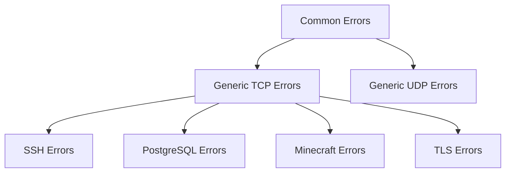

**Greet** is a lightweight Go library to test greet / ping / handshake process in TCP, UDP and other popular protocols based on them.

## Goals
- Fast: The library only performs handshake without entering full session
- Secure: The process ends before authentication / authorization step
- Lightweight: The library constructs raw command from scratch and does not depend on third-party service clients
- Tracing: The library outputs helpful errors from connection init to handshake

## Use case
- Greet is good enough to test connectivity, service name and service version.

## Installation

### Library

```bash
go get github.com/crystade/greet@latest
```

Then import and use in your Go code:

```go
import "github.com/crystade/greet"

func main() {
    ctx := context.Background()
    result, err := greet.Greet(ctx, "ssh", "github.com:22")
    // ...
}
```

### CLI

```bash
go install github.com/crystade/greet/cmd/greet@latest
```

Or build from source:

```bash
go build -o greet ./cmd/greet/
```

## Library Usage

The [`greet.Greet()`](greet.go:14) function is the primary entry point:

```go
result, err := greet.Greet(ctx, "ssh", "github.com:22")
if err != nil {
    // handle *greet.GreetError
}
fmt.Println(result.Success, result.TTDR, result.RTT, result.TTFB, result.TTLB, result.Data)
```

Customize behavior with functional options:

```go
result, err := greet.Greet(ctx, "minecraft", "hypixel.net:25565",
    greet.WithTimeout(10*time.Second),
    greet.WithProtocolConfig(&minecraft.Config{ProtocolVersion: 775}),
)
```

For pre-resolved protocols, use [`greet.GreetWith()`](greet.go:29):

```go
p, _ := greet.Get("ssh")
result, err := greet.GreetWith(ctx, p, "github.com", 22)
```

See [`greet.go`](greet.go) and [`options.go`](options.go) for the complete API.

## CLI Usage

```
greet <protocol> <host>[:<port>] [flags]
```

### Commands

| Command | Description |
|---------|-------------|
| `greet list` | List all registered protocols |
| `greet --help` | Show help |

### Examples

```bash
# Generic TCP — test connectivity to a port
greet tcp example.com:80

# SSH — read server version banner
greet ssh github.com:22

# PostgreSQL — probe SSL support
greet postgresql localhost:5432

# PostgreSQL — skip SSL probe
greet postgresql localhost:5432 --sslmode=disable

# Minecraft Java — query server status
greet minecraft hypixel.net:25565

# Minecraft — specify protocol version (default: 775)
greet minecraft localhost:25565 --protocol-version=775

# Use default port (from protocol's well-known port)
greet ssh github.com        # equivalent to github.com:22

# TLS — check leaf certificate
greet tls expired.badssl.com:443
```

### Output

All commands output structured results to stdout with timing metrics.
All four timing metrics share the same starting anchor time:

```
|------|         TTDR: from start to when DNS resolves
|------|--|      RTT:  from start to when first ACK at TCP transport or Receive at UDP
|------|--|-|    TTFB: from start to when first byte response at the correct protocol layer
|------|--|-------| TTLB: from start to when last byte response at the correct protocol layer
```

Example CLI output:

```
Protocol: ssh
Transport: tcp
TTDR: 12.345ms
RTT: 34.567ms
TTFB: 45.123ms
TTLB: 45.200ms
Success: true
Version String: SSH-2.0-OpenSSH_8.9
```

Errors are output as JSON to stderr:

```json
{
  "success": false,
  "error": "[ssh] connection_refused: connection to localhost:22 refused",
  "code": "connection_refused",
  "protocol": "ssh"
}
```

### Protocol-Specific Flags

| Protocol | Flag | Default | Description |
|----------|------|---------|-------------|
| `postgresql` | `--sslmode` | `prefer` | SSL mode: `prefer` (try SSL) or `disable` (skip SSL) |
| `minecraft` | `--protocol-version` | `775` | Minecraft protocol version (e.g. `775` for 26.1) |

## Protocols
### Error Code Reuse Hierarchy

Protocols inherit error codes from their transport layer:



#### Common Errors

| Error Code | Description |
|---|---|
| `resolve_host_failed` | Failed to resolve hostname to IP address |
| `invalid_address` | Invalid host or port format |
| `unknown_protocol` | Requested protocol name is not registered |
| `invalid_config` | Protocol-specific configuration is malformed or of the wrong type |

#### Generic TCP Errors

| Error Code | Description |
|---|---|
| `connection_refused` | Server actively refused the connection |
| `connection_timeout` | TCP connection attempt timed out |
| `connection_reset` | Connection reset by remote peer |
| `network_unreachable` | Target network is unreachable |
| `connection_failed` | Generic connection failure (unknown OS error) |

#### Generic UDP Errors

| Error Code | Description |
|---|---|
| `send_failed` | Failed to send UDP datagram |
| `receive_timeout` | Timed out waiting for UDP response |
| `port_unreachable` | Received ICMP port unreachable |

---

### Generic TCP

- **Input**: Host, Port
- **Output**: Success with TTDR/RTT/TTFB/TTLB timing, or an error code from Common + Generic TCP errors

### Generic UDP

- **Input**: Host, Port
- **Output**: Success with TTDR/RTT/TTFB/TTLB timing, or an error code from Common + Generic UDP errors

### SSH (TCP)

- **Input**: Host, Port (default `22`)
- **Output**: Success with server version string (e.g. `SSH-2.0-OpenSSH_8.9`) and TTDR/RTT/TTFB/TTLB timing, or an error code

Inherits: Common + Generic TCP errors

| Error Code | Description |
|---|---|
| `banner_timeout` | Timed out waiting for SSH version banner |
| `invalid_banner` | Received malformed SSH version string |

### PostgreSQL (TCP)

- **Input**: Host, Port (default `5432`), SSL Mode (default `prefer`)
- **Output**: Success with SSL support flag and TTDR/RTT/TTFB/TTLB timing, or an error code

Inherits: Common + Generic TCP errors

| Error Code | Description |
|---|---|
| `startup_timeout` | Timed out waiting for server response |
| `send_failed` | Failed to send packet to the server |
| `malformed_response` | Received malformed PostgreSQL message |
| `ssl_rejected` | Server does not support requested SSL mode |

### Minecraft Java (TCP)

- **Input**: Host, Port (default `25565`), Protocol Version (required, VarInt — e.g. `775` for Minecraft 26.1). Intent is automatically set to Status (1) by the library.
- **Output**: Success with server status JSON (MOTD, players, version) and TTDR/RTT/TTFB/TTLB timing, or an error code

Inherits: Common + Generic TCP errors

| Error Code | Description |
|---|---|
| `handshake_timeout` | Timed out waiting for status response |
| `handshake_failed` | Failed to send handshake or status request |
| `malformed_response` | Received malformed status response |

### TLS (TCP)

- **Input**: Host, Port (default `443`)
- **Output**: Success with leaf certificate details, presented certificate chain, and TTDR/RTT/TTFB/TTLB timing, or an error code

Inherits: Common + Generic TCP errors

| Error Code | Description |
|---|---|
| `tls_handshake_failed` | TLS handshake with server failed |

> **Limitation**: This is a lightweight certificate metadata probe, not a full browser/WebPKI validator. It does **not** perform trust-chain verification, revocation queries (OCSP/CRL fetching), SCT/CT policy checks, EKU validation, or name-constraint enforcement. The checks are heuristic and inspired by Chrome's `CERT_*` flags, but are not equivalent to Chrome's security UI.

#### Certificate Status (`status` field)

The `status` field is the **chain-level status**: it holds the `CERT_*` flags from the first certificate (walking leaf → root) that has a non-OK check, or `["OK"]` if every certificate in the chain passes all checks. Multiple flags can appear simultaneously.

Each certificate in the `cert_chain` array also carries its own per-certificate `status`. The checks that apply depend on the certificate's role:

- **Leaf-only checks**: `CERT_COMMON_NAME_INVALID`, `CERT_AUTHORITY_INVALID(self-signed)`, `CERT_SELF_SIGNED_LOCAL_NETWORK`, `CERT_VALIDITY_TOO_LONG`
- **All certs**: `CERT_DATE_INVALID`, `CERT_WEAK_SIGNATURE_ALGORITHM`, `CERT_WEAK_KEY`
- **Non-self-signed certs**: `CERT_NO_REVOCATION_MECHANISM` (root CAs are self-signed and excluded)

| Status | Condition |
|---|---|
| `OK` | No issues detected |
| `CERT_DATE_INVALID(not-yet-valid)` | Current time is before `NotBefore` |
| `CERT_DATE_INVALID(expired)` | Current time is after `NotAfter` |
| `CERT_COMMON_NAME_INVALID` | Certificate does not match the requested hostname (checks SANs, falls back to CN) |
| `CERT_AUTHORITY_INVALID(self-signed)` | Issuer equals Subject (cryptographically verified) and cert has no local network names |
| `CERT_SELF_SIGNED_LOCAL_NETWORK` | Self-signed cert whose SANs include a `.local` DNS name, loopback IP, private IP, or link-local address — mutually exclusive with `CERT_AUTHORITY_INVALID(self-signed)` |
| `CERT_NO_REVOCATION_MECHANISM` | Non-self-signed cert has no OCSP responder and no CRL distribution points |
| `CERT_WEAK_SIGNATURE_ALGORITHM` | Signed with MD2/RSA, MD5/RSA, SHA1/RSA, DSA/SHA1, or ECDSA/SHA1 |
| `CERT_WEAK_KEY` | RSA key < 2048 bits, or ECDSA key < 256 bits |
| `CERT_VALIDITY_TOO_LONG` | Leaf cert issued on or after 2020-09-01 with validity > 398 days (Apple/Chrome/Firefox CA/B Forum policy) |

## Contribution
Due to overhead of maintenance, we only accept popular protocols for now.

Postpone:
- DNS: having the most RFCs and Drafts attached to it of all protocols, we are looking to provide support to a subset of popular DNS protocols only

## License

This project is licensed under the MIT License - see the [LICENSE](LICENSE) file for details.
